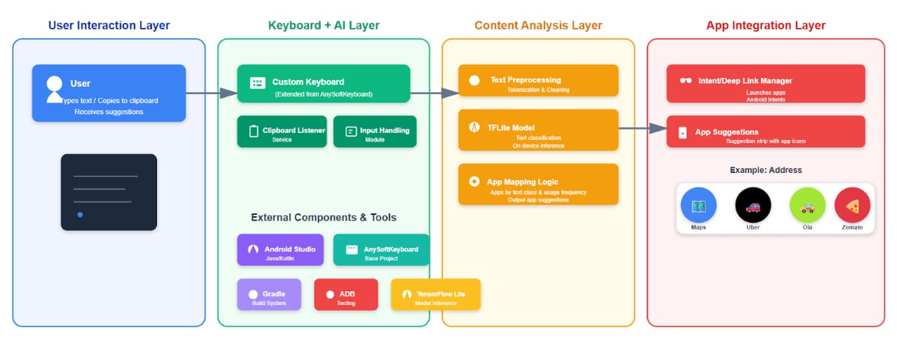
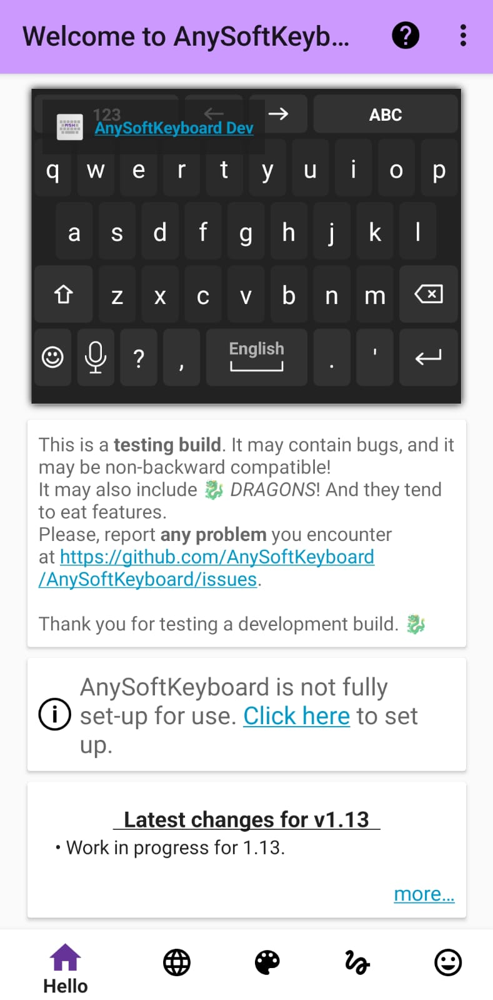
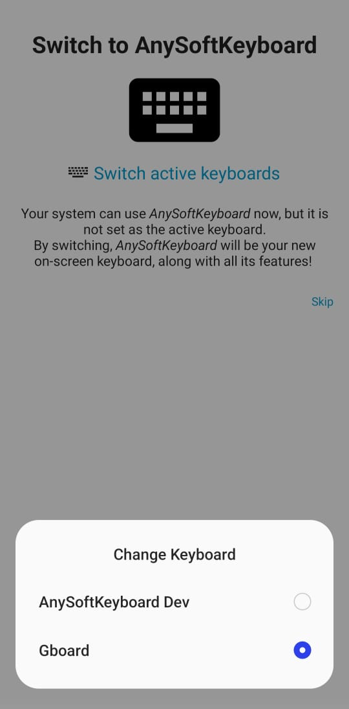
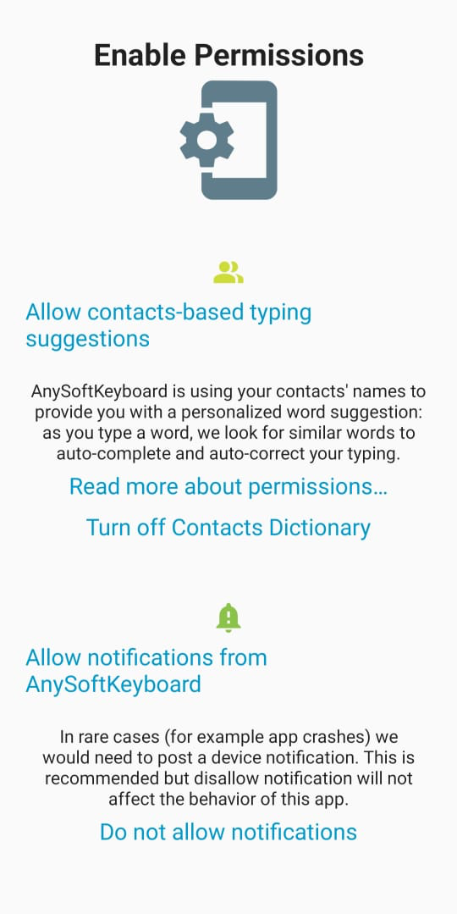
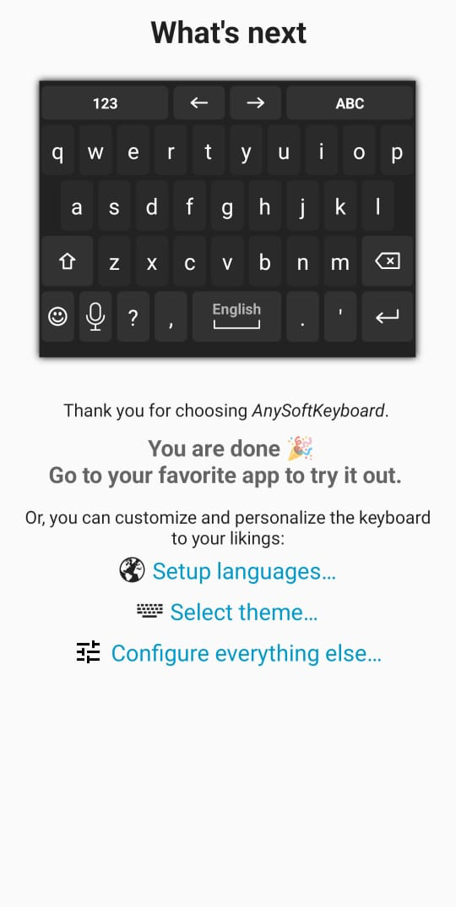
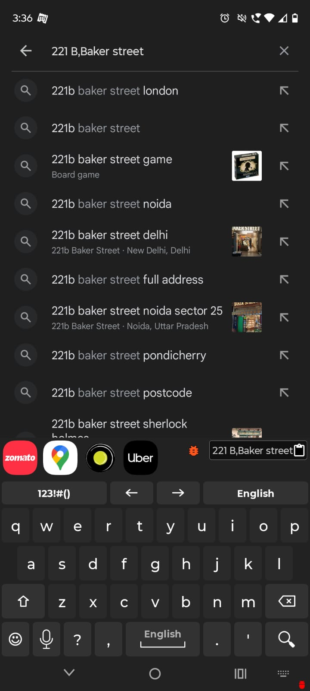
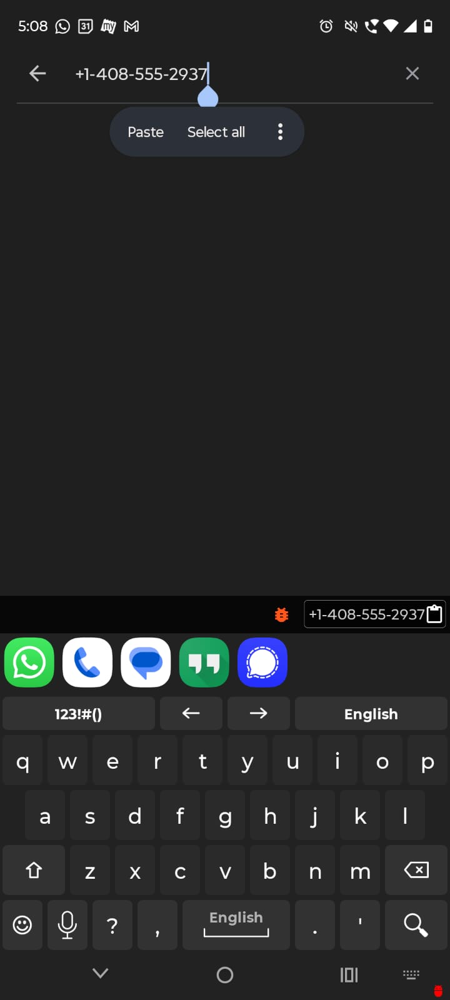
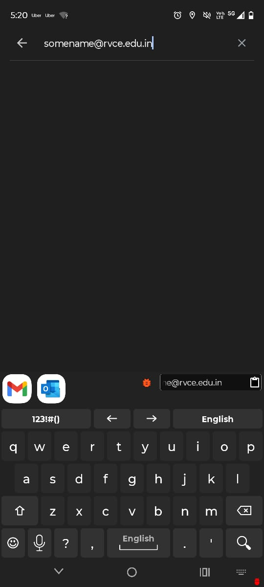
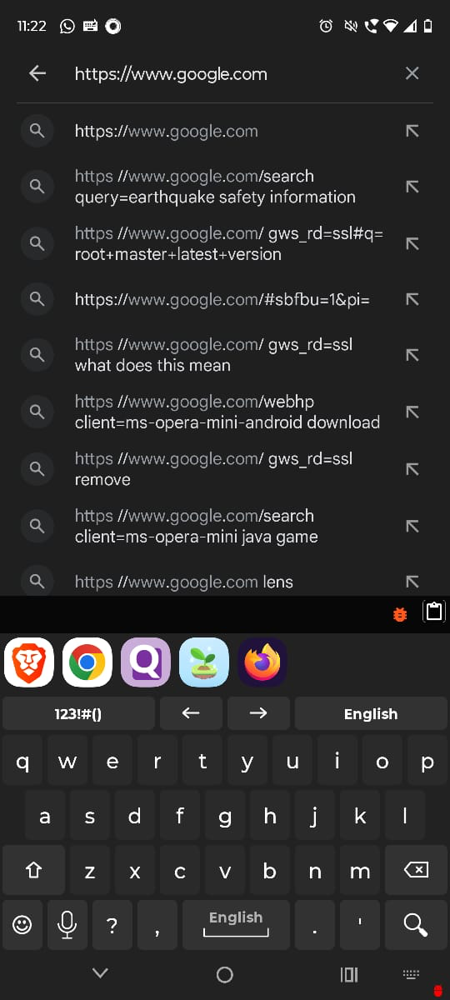
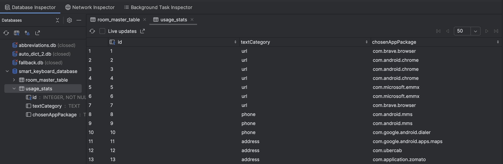

# Smart Clipboard Assistant: Context-Aware App Suggestions

## Table of Contents

1. [Project Overview & Purpose](#1-project-overview--purpose)
2. [Key Features](#2-key-features)
3. [Technical Architecture](#3-technical-architecture)
4. [Setup Guide](#4-setup-guide)
    - [A. Android Application Setup](#a-android-application-setup)
    - [B. AI Model Training Setup (Optional)](#b-ai-model-training-setup-optional)
    - [C. How to Install the App](#c-how-to-install-the-app)
5. [How to Use the App](#5-how-to-use-the-app)
6. [Technologies Used](#6-technologies-used)
7. [Stakeholder Analysis](#7-stakeholder-analysis)
8. [Privacy & Security](#8-privacy--security)
9. [Acknowledgments](#9-acknowledgments)
10. [Copyright Requirement](#10-copyright-requirement)
11. [License](#11-license)

---

## 1. Project Overview & Purpose

In today's mobile first world, users frequently copy text such as addresses, phone numbers, links, and emails and then manually navigate to another app to use that information. This multi-step process is inefficient, breaks user concentration, and wastes valuable time.

The **Smart Clipboard Assistant** is a technologically sophisticated and highly compelling product concept that addresses a genuine user pain point: the friction of manually switching between applications to use copied text. It analyzes copied text in real-time and proactively suggests the most relevant applications, allowing users to navigate to the right app with a single tap.

Unlike the default Android system, which only provides suggestions for pre-formatted, clickable links, our assistant works on any copied plain text, making it a universally powerful utility.

---

## 2. Key Features

Our prototype successfully implements the four core phases of our development plan, delivering an intelligent user experience.

- **Smooth Clipboard Monitoring:** By functioning as a default keyboard (InputMethodService), the app gains reliable, real-time access to the clipboard, fully complying with Android 10+ privacy restrictions without resorting to fragile workarounds.

- **On-Device AI Text Classification:** A fine-tuned DistilBERT model runs directly on the device using TensorFlow Lite. It analyzes copied text in under 100ms and classifies it into categories (e.g., address, phone, url) without ever sending user data to the cloud, ensuring 100% privacy.

- **Contextual App Suggestions:** Immediately after copying text, the keyboard's suggestion strip is dynamically replaced with icons of the most relevant apps installed on the user's device.

- **Personalized Learning Engine:** The assistant learns from the user's choices by tracking which apps are used for specific text types using an on-device Room database. It suggests only applications installed on your device, ranks future suggestions based on learned usage, and automatically adapts as you install or remove apps, making the keyboard progressively smarter and more personalized over time.

---

## 3. Technical Architecture


Our primary focus was on building a robust technical foundation ("Tech Over Fancy UI"). The architecture was designed to be powerful, efficient, and privacy-centric.

- **Core Framework (Custom Keyboard):** The application is a fork of the open source AnySoftKeyboard project. This approach was strategically chosen to bypass Android's strict background clipboard access limitations, providing a stable and officially supported method for monitoring the clipboard.

- **AI Core (On-Device Inference):**
    - **Model:** A DistilBERT model, pre-trained on a large corpus and finetuned on a custom dataset for specific categories like addresses, phone numbers, and URLs.
    - **Deployment:** The model is converted to the `.tflite` format and deployed in the Android app's assets. We use the TensorFlow Lite Task Library (BertNLClassifier) for high performance, on device inference.

- **App Integration (Intents):** The system uses standard Android Intents to discover and launch relevant applications. The PackageManager queries for apps that can handle specific actions (e.g., ACTION_VIEW for a geo: URI), ensuring broad compatibility across the Android ecosystem.

- **Personalization (On-Device Database):** User preferences are stored locally and privately using the Android Room Persistence Library. This data is used to re-rank app suggestions, fulfilling the "learn user habits" feature.

---

## 4. Setup Guide

This project consists of two main parts: the Android application and the Python script for training the AI model.

### A. Android Application Setup

#### Prerequisites:

- Android Studio (latest stable version recommended)
- An Android emulator or physical device running Android 7.0 (API 24) or higher
- Android device with developer options enabled
- USB debugging enabled (for ADB installation method)
- File manager app with installation permissions

#### Steps:

**1. Clone the Repository:**

```bash
git clone https://github.com/RD500/Smart-Clipboard-Assistant.git
```

**2. The TFLite Model:**

- In Android Studio's "Project" view, navigate to the `ime/app/src/main/assets` directory
- The trained model (`model.tflite`) is already included in the `assets` folder.
- If you would like to generate the model yourself, please follow the steps outlined in [B. AI Model Training Setup](#b-ai-model-training-setup-optional).

**3. Open in Android Studio:**

- Open Android Studio and select **Open an Existing Project**
- Navigate to and select the cloned repository folder

**4. Build and Run:**

- Wait for Gradle to sync all project dependencies
- Before clicking **Run** make sure to select **ime.app** in Configurations
- Click the **Run** button to build and install the app on your emulator or device

**If using a physical device:**

a. **Enable Developer Options**
- On your phone, go to:  
  `Settings → About phone → Tap "Build number" 7 times`  
  (You will see a message: "You are now a developer!")

b. **Enable USB or Wireless Debugging**
- Navigate to:  
  `Settings → Developer options → USB debugging` (for USB connection)  
  or  
  `Settings → Developer options → Wireless debugging` (for Wi-Fi connection)

c. **Pair your device** (for Wireless debugging):
- In **Developer options → Wireless debugging**, tap **Pair device with QR code** or **Pair using pairing code**.
- In Android Studio, go to **Device Manager → Pair using Wi-Fi → Scan QR code / Enter pairing code**.

d. Select your device from the device list in Android Studio and click **Run** to install the app.

**5. First-Time Setup on Device:**

When you launch the app for the first time, a setup wizard will guide you through enabling the keyboard.

**Steps:**

1. Enable the **Smart Clipboard Assistant** in your device's keyboard settings.
2. Switch your active input method to **Smart Clipboard Assistant**.



#### Guided Setup Screens

- On the setup screen, tap **Click here** → **Switch active keyboard** → select **AnySoftKeyboard Dev**.



- Next, you will see the **Enable Permission** screen.  
  Here, you can choose to either **Turn On** or **Turn Off** the permission.  
  This permission is **optional** — whether you enable it or not, it will **not affect the core functionality** of the app.



- Once completed, you will see the **"You are done"** screen confirming setup is finished.



**6. Build Your Own APK:**
- Click Build → Generate App Bundles or APKs → Generate APKs in Android Studio.
- Wait for the build to finish. You can find the APK in:
  ime/app/build/outputs/apk/debug/app-debug.apk
---

### B. AI Model Training Setup (Optional)

The repository already includes a pre-trained `model.tflite`. These steps are only necessary if you wish to retrain the model with your own data or with the dataset used in this project.

#### Prerequisites:

- A Google account to use Google Colab
- A custom dataset in `.csv` format with `text` and `label` columns that that represent the categories you want to identify or you can use the dataset provided in the repository (`generated_contacts_dataset.csv`) in ml folder

#### Sample of Dataset

| text                                          | label   |
|-----------------------------------------------|---------|
| 123 Main St, Anytown, USA 12345               | address |
| Call me at (555) 123-4567                     | phone   |
| Check out https://www.example.com/product/123 | url     |
| My email is contact@email.com                 | email   |

#### Steps:

**1. Open the Colab Notebook:**

- Upload the `clipboard_classifier_training.ipynb` notebook (included in this repository in ml folder) to Google Colab

**2. Set Runtime:**

- In the Colab menu, go to **Runtime** → **Change runtime type** and select **T4 GPU**

**3. Run the Notebook:**

- Execute all cells in the notebook. It will install the necessary libraries, load the data, train the model, and export the final `distilbert_model_clean.tflite` model, labels.txt, vocab.txt
- It also includes cell to test the `distilbert_model_clean.tflite` model on a sample inputs

**4. Add Metadata to the Model:**

Once the `distilbert_model_clean.tflite` file is generated, you need to embed metadata into it. This step requires:

- Python **<= 3.11**
- [`tflite-support`](https://www.tensorflow.org/lite/inference_with_metadata/lite_support) library installed

⚠️ It is strongly recommended to create a **virtual environment** for this step to avoid dependency conflicts.

**Example (using `venv`):**

```bash
# Create a virtual environment
python3 -m venv tflite-env

# Activate it
# On Linux/Mac:
source tflite-env/bin/activate
# On Windows (Powershell):
.\tflite-env\Scripts\activate

# Install dependencies
pip install --upgrade pip
pip install tflite-support

# Or Install dependencies from the requirements file
pip install -r requirements.txt
```

- To do this, run the provided `met.py` in ml folder script **on your local machine**.
- Before running, update the file paths inside `met.py` to point to the correct locations of:
    - `distilbert_model_clean.tflite`
    - `labels.txt`
    - `vocab.txt`

**Example snippet from `met.py`:**

```python
INPUT_TFLITE_MODEL = "path/to/distilbert_model_clean.tflite"
LABELS_FILE = "path/to/labels.txt"
VOCAB_FILE = "path/to/vocab.txt"
OUTPUT_TFLITE_MODEL = "path/to/distilbert_with_metadata.tflite"
```

**Run the script locally:**

```bash
python met.py
```

- This will generate the final `distilbert_with_metadata.tflite` file with metadata embedded.
- Rename `distilbert_with_metadata.tflite` to `model.tflite` and place it in `ime/app/src/main/assets` directory

---

### C. How to Install the App

You can download the latest APK from the [Releases](../../releases) section of this repository.

#### Method 1: Install Directly on Device

**1. Enable Unknown Sources** (if prompted):

- Navigate to:  
  `Settings → Apps → Special app access → Install unknown apps`
- Select your file manager or browser
- Toggle **Allow from this source**

**2.** Open the downloaded `Smart_Clipboard_Assistant.apk` file and install it.

#### Method 2: Install via ADB (Recommended for Developers)

**1.** Ensure your Android device is connected to your computer with **USB debugging enabled**.

- You can enable this in:  
  `Settings → Developer options → USB debugging`

**2.** Install the APK using the following command:

```bash
adb install Smart_Clipboard_Assistant.apk
```

---

## 5. How to Use the App

1. Ensure the "AnySoftKeyboard" is set as your default keyboard

2. Open any application with a text field (e.g., a notes app, browser, or messenger)

3. Copy a piece of text:
    - **Address:** 1 Infinite Loop, Cupertino, CA
    - **Phone:** 9657234561
    - **URL:** https://www.google.com
    - **Email:** john.c@gmail.com

4. Observe the keyboard's suggestion strip, which will now display icons of relevant apps

5. Tap an icon to launch the app with the copied text

6. To test personalization, copy a phone number and select a non-default app (like WhatsApp). Copy another phone number, and notice that WhatsApp is now suggested first.

 
 


---

## 6. Technologies Used

- **Android SDK:** Core platform for mobile development
- **TensorFlow Lite:** On-device machine learning inference
- **DistilBERT:** Lightweight BERT model for text classification
- **Room Database:** Local data persistence
- **AnySoftKeyboard:** Open-source keyboard framework

---
## 7. Stakeholder Analysis

Our project is designed to create tangible value for three distinct groups: the everyday Consumers who use smartphones, the Businesses who develop applications, and our Team as creators of this technology.

#### 1. The Consumer (The End-User)
This is the primary beneficiary of our solution. Consumers are anyone who uses an Android smartphone and performs copy paste actions regularly.

**Their Problem:** The current copy paste workflow is fragmented and inefficient. A user copies a piece of information and must then manually navigate through their device to find and open the right application to use that information. This process is slow, repetitive, and breaks concentration, leading to wasted time and a frustrating user experience.

**Our Impact & Value:**

- **Increased Productivity:** We reduce the number of steps required to perform a task (e.g. navigating to an address) by up to 80%. What previously took 6-7 taps now takes a single tap.
- **Frictionless Experience:** The keyboard proactively brings the right tools to the user, creating a seamless and intuitive workflow that feels like a natural extension of their intent.
- **Personalization:** The system learns and adapts. By prioritizing the user's most frequently used apps for specific tasks (e.g., learning you prefer Uber over Google Maps for addresses), the assistant becomes more efficient and personalized over time.
- **Privacy & Security:** By performing all AI classification directly on the device, we guarantee that the user's clipboard content which can be highly sensitive is never sent to the cloud. This privacy first design builds trust and ensures security.

#### 2. The Business (App Developers & Device Manufacturers like Samsung)
This group benefits from the new, streamlined pathway our solution creates between user intent and app engagement.

**Their Goal:** To increase user engagement, become the default application for specific tasks, and offer innovative features that differentiate their products.

**Our Impact & Value:**

- **Increased App Engagement:** Our keyboard creates a high intent, low friction entry point into applications. When a user copies an address, apps like Uber, Zomato, or Google Maps can be suggested, driving traffic directly to them at the moment of need.
- **Preference Based Promotion:** The personalization feature acts as an organic promotion engine. The apps a user actually prefers are surfaced more frequently, reinforcing brand loyalty and increasing their market share of user actions.
- **Competitive Advantage for Samsung:** For a device manufacturer like Samsung, integrating this feature into the native Samsung Keyboard provides a unique, intelligent, and genuinely useful function that competitors lack. It enhances the value of the One UI ecosystem and showcases leadership in on device AI.

#### 3. The Team 
As the developers, this project serves as a demonstration of our ability to solve a complex, real world problem through creative technical implementation.

**Our Goal:** To build a working, impactful prototype that meets the hackathon's technical and creative challenges.

**Our Achievements & Showcased Skills:**

- **Technical Depth:** We successfully integrated a sophisticated DistilBERT model into an Android application for on device inference, implemented a local database for personalization, and navigated complex Android permissions.
- **Creative Problem Solving:** We bypassed Android's modern clipboard restrictions by building upon an open-source keyboard framework a key workaround that made the project feasible and secure.
- **End-to-End Execution:** We managed the entire project lifecycle from data preparation and model training in Google Colab to final deployment and UI/UX implementation in a functional Android app. This demonstrates our ability to deliver a complete, polished solution.

## 8. Privacy & Security

All text processing happens **100% on-device**. No data is ever sent to external servers, ensuring complete user privacy and data security.

---

## 9. Acknowledgments

This project is built upon the open-source AnySoftKeyboard project. We thank the open-source community for their invaluable contributions.

---

## 10. Copyright Requirement

_Remember:_ the components in this repository are released under the Apache2 license. By contributing to this repository you give all copyright and distribution rights to the [AnySoftKeyboard maintainer](https://github.com/menny).

---

## 11. License

```
Copyright 2009 Menny Even-Danan

Licensed under the Apache License, Version 2.0 (the "License");
you may not use this file except in compliance with the License.
You may obtain a copy of the License at

http://www.apache.org/licenses/LICENSE-2.0

Unless required by applicable law or agreed to in writing, software
distributed under the License is distributed on an "AS IS" BASIS,
WITHOUT WARRANTIES OR CONDITIONS OF ANY KIND, either express or implied.
See the License for the specific language governing permissions and
limitations under the License.
```
